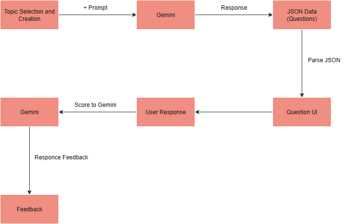
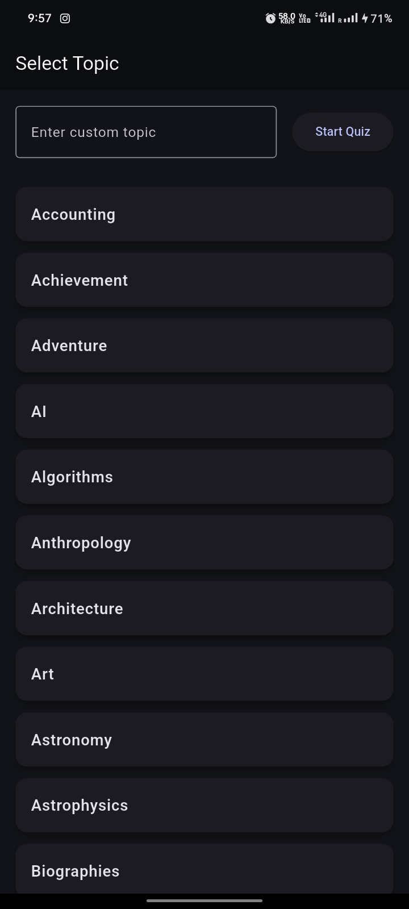
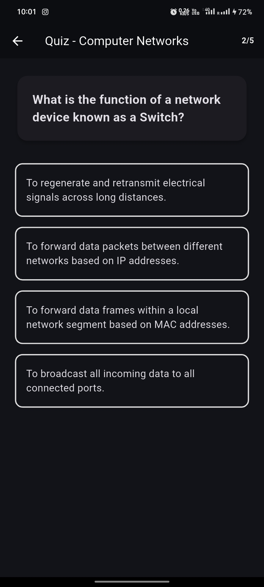
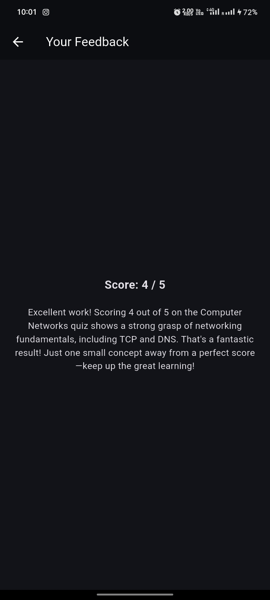

# AI Quiz App (Plum Quiz App)

A Flutter application that generates personalized quizzes using Google's Gemini AI. Users can select topics, answer AI-generated questions, and receive intelligent feedback on their performance.

## Demo Video
[Demo Video Link](https://drive.google.com/file/d/1CHExW4om4ngsPwY5hXi2wRLK8jlkC1yo/view?usp=drive_link)

## Features

- **AI-Powered Quiz Generation**: Leverages Google Gemini AI to create dynamic, topic-specific questions
- **Topic Selection**: Choose from various subjects to customize your learning experience
- **Interactive Quiz Interface**: Clean, user-friendly design with progress tracking
- **Intelligent Feedback**: Receive personalized feedback based on your quiz performance
- **Real-time Question Generation**: Questions are generated on-demand for fresh content
- **Cross-platform Support**: Built with Flutter for iOS, Android, and web compatibility

## Prerequisites

- Flutter SDK (>=3.4.4 <4.0.0)
- Dart SDK
- Google Gemini API key

## Installation

1. **Clone the repository**
   ```bash
   git clone https://github.com/vishal-sah/plum-quiz-app.git
   cd plum_a2
   ```

2. **Install dependencies**
   ```bash
   flutter pub get
   ```

3. **Set up your Gemini API key**
   - Get your API key from [Google AI Studio](https://aistudio.google.com/apikey)
   - Open `lib/main.dart`
   - Replace `'--- Your Gemini Api Key ---'` with your actual API key

4. **Run the application**
   ```bash
   flutter run
   ```

## Project Structure

```
lib/
├── main.dart                    # App entry point with Gemini initialization
├── core/
│   ├── ai/
│   │   ├── ai_service.dart      # Gemini AI integration service
│   │   └── prompt_builder.dart  # AI prompt construction utilities
│   ├── models/
│   │   ├── question.dart        # Question data model
│   │   └── feedback.dart        # Feedback data model
│   └── utils/                   # Utility functions
├── screens/
│   ├── topic_selection/
│   │   └── topic_selection_screen.dart  # Topic selection interface
│   ├── quiz/
│   │   └── quiz_screen.dart     # Quiz interface
│   ├── feedback/
│   │   └── feedback_screen.dart # Results and feedback display
│   └── loading/
│       └── loading_screen.dart  # Loading states
├── state/
│   └── quiz_provider.dart       # State management with Riverpod
├── theme/
│   └── app_theme.dart          # App theming
└── widgets/
    └── custom_button.dart      # Reusable UI components
```

## Dependencies

- **flutter_gemini**: Google Gemini AI integration
- **flutter_riverpod**: State management
- **cupertino_icons**: iOS-style icons

## Architecture



The diagram above illustrates the overall architecture of the Plum Quiz App, including AI integration, state management, and UI flow.


## Configuration

### Environment Variables
Create a `.env` file in the root directory (optional):
```
GEMINI_API_KEY=your_api_key_here
```

### API Key Security
For production apps, consider using:
- Flutter's `--dart-define` for build-time configuration
- Environment-specific configuration files
- Secure key management services

## Usage

1. **Launch the app** - The main screen displays available quiz topics
2. **Select a topic** - Choose from the list of available subjects
3. **Take the quiz** - Answer AI-generated questions with multiple choice options
4. **Navigate questions** - Use Previous/Next buttons to move between questions
5. **Complete the quiz** - Submit your answers and view results
6. **Receive feedback** - Get personalized insights based on your performance

## Features in Detail

### AI Integration
- Uses Google Gemini AI for dynamic content generation
- Fallback questions ensure app functionality even if API is unavailable
- Error handling and retry mechanisms for robust performance

### State Management
- Riverpod for reactive state management
- Separate providers for quiz state and UI state
- Immutable state objects for predictable behavior

### User Experience
- Progress indicators show quiz completion status
- Intuitive navigation with clear action buttons
- Responsive design for various screen sizes

## Development

### Running Tests
```bash
flutter test
```

### Building for Production
```bash
# Android
flutter build apk --release

# iOS
flutter build ios --release

# Web
flutter build web --release
```

### Adding New Features
1. Follow Flutter's [style guide](https://docs.flutter.dev/resources/dart-style)
2. Add appropriate tests for new functionality
3. Update documentation as needed
4. Ensure AI prompts are well-structured for consistent results

## Screenshots
| Screenshot | Description |
|------------|-------------|
|  | Topic selection interface where users choose quiz subjects |
|  | Displays loading animation while questions are being generated |
|  | Quiz interface displaying AI-generated questions and options |
|  | Results and personalized feedback after quiz completion |


## Troubleshooting

### Common Issues

**"Gemini not initialized" error:**
- Ensure your API key is correctly set in `lib/main.dart`
- Verify the API key is valid and has proper permissions

**No questions generated:**
- Check your internet connection
- Verify API key limits haven't been exceeded
- Review console logs for specific error messages

**App crashes on topic selection:**
- Ensure all required dependencies are installed
- Check that Gemini initialization occurs before widget tree creation

## Contributing

1. Fork the repository
2. Create a feature branch (`git checkout -b feature/amazing-feature`)
3. Commit your changes (`git commit -m 'Add amazing feature'`)
4. Push to the branch (`git push origin feature/amazing-feature`)
5. Open a Pull Request

## Acknowledgments

- Google Gemini AI for powerful language model capabilities
- Flutter team for the excellent cross-platform framework
- Riverpod for state management solution

---

**Note**: This application requires an active internet connection to generate questions using the Gemini AI service. Offline functionality is limited to cached content and fallback questions.
